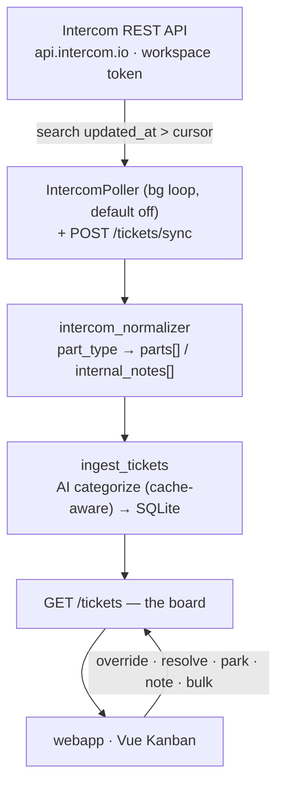

# 📚 Intercom Triage — Docs Hub

The front door to every doc in this repo. **Pick where you want to go**, skim the
architecture, expand a section for detail. One rule everywhere: *this hub points,
it never duplicates* — the linked doc is always the source of truth.

> **What it is:** a self-hosted tool that pulls recent Intercom conversations
> server-side, pre-categorizes + summarizes them with AI, and serves one Kanban
> board so a few agents triage and route from a shared view instead of opening
> each ticket. Two packages (backend · webapp), both reachable over `localhost` in dev.

---

## Contents

- [Go to…](#go-to) — intent-routed navigation
- [Architecture at a glance](#architecture-at-a-glance) — the data flow
- [Reference (expand)](#reference-expand) — data model · API · invariants
- [Full documentation map](#full-documentation-map)

---

## Go to…

| I want to… | Open |
|---|---|
| **Get oriented** — architecture, data flow, stack, data model, API surface, glossary | [`PROJECT.md`](./PROJECT.md) — the canonical handbook |
| **See what the product does** — every shipped feature by capability area | [`FEATURES.md`](./FEATURES.md) |
| **Read the requirements** (the *what*: `US-*` / `FR-*` / `NFR-*`) | [`contract/spec.md`](./contract/spec.md) |
| **Read the architecture decisions** (the *how*: §1..) | [`contract/plan.md`](./contract/plan.md) |
| **Find a task / traceability** (`T001..`) | [`contract/tasks.md`](./contract/tasks.md) |
| **Know the per-change rules + the 14 invariants** | [root `CLAUDE.md`](../CLAUDE.md) |
| **Follow the engineering principles** | [`principles.md`](./principles.md) |
| **Run the stack / quickstart** | [root `README.md`](../README.md) |
| **Work inside one package** | [`backend/CLAUDE.md`](../backend/CLAUDE.md) · [`webapp/CLAUDE.md`](../webapp/CLAUDE.md) |
| **Understand *why* a feature was built this way** | [`superpowers/specs/`](./superpowers/specs/) + [`superpowers/plans/`](./superpowers/plans/) — the design archive |
| **Dig through retired/point-in-time artifacts** | [`_archive/`](./_archive/) — history only |

---

## Architecture at a glance

The backend polls Intercom directly with a workspace Access Token, normalizes
each conversation server-side, runs the cache-aware AI categorization, and serves
the board. The webapp is the sole client surface.

Deeper: [`PROJECT.md` §3 Architecture & data flow](./PROJECT.md#3-architecture--data-flow).

---

## Reference (expand)

<b>Data model</b> — tables &amp; key constraints

SQLite by default (Postgres-swappable via `DATABASE_URL`). Naive-UTC in the DB,
`Z`-suffixed on the wire. Core tables: `tickets`, `ai_cache`, `categories`,
`category_proposals`, `overrides`, `followups`, `ticket_notes`, `note_entries`,
`note_attachments`, `playbooks`, `snippets`, `ticket_embeddings`,
`ticket_clusters`, `settings` (singleton `CHECK id = 1`).

Full table-by-table breakdown: [`PROJECT.md` §6 Data model](./PROJECT.md#6-data-model).

<b>API surface</b> — endpoint groups

health/metrics · categories · proposals · tickets (read/ingest/**sync**) ·
tickets (single + bulk, capped 200) · followups · notes · note entries ·
attachments · settings · snippets · stats · playbooks · clusters.

Full endpoint list: [`PROJECT.md` §8 API surface](./PROJECT.md#8-api-surface).
Interactive docs at <http://localhost:4000/docs> while the backend runs.

<b>The 14 cross-package invariants</b> — the things that break if you forget them

The canonical text + rationale lives in [root `CLAUDE.md` → "Cross-package
invariants"](../CLAUDE.md#cross-package-invariants). Highlights: backend owns
Intercom ingestion via the Access Token (#1); `HydratedTicket` spans backend↔webapp
(#2); the `part_type` mapping routes customer-visible `parts[]` vs team-only
`internal_notes[]` (#3/#4); the AI cache key is the content signature, not Intercom
`updated_at` (#6); fallbacks are never cached (#7); `Settings` is a singleton (#12).

Index form: [`PROJECT.md` §7](./PROJECT.md#7-the-14-cross-package-invariants-index).

---

## Full documentation map

| Doc | Owns |
|---|---|
| [`README.md`](./README.md) (this) | The hub — navigation + architecture snapshot. Links, never duplicates. |
| [`PROJECT.md`](./PROJECT.md) | System orientation: architecture, data flow, stack, data model, API surface, feature status, glossary. **Canonical handbook.** |
| [`FEATURES.md`](./FEATURES.md) | Exhaustive feature catalog by capability area, with code anchors. |
| [`contract/spec.md`](./contract/spec.md) · [`contract/plan.md`](./contract/plan.md) · [`contract/tasks.md`](./contract/tasks.md) | Requirements (what) · architecture decisions (how) · traceability matrix. **Contract source of truth.** |
| [root `CLAUDE.md`](../CLAUDE.md) (+ per-package) | Per-change rules + the 14 invariants. Auto-loaded every session. |
| [`principles.md`](./principles.md) | The four engineering principles. |
| [`superpowers/specs/`](./superpowers/specs/) + [`superpowers/plans/`](./superpowers/plans/) | Per-feature design records ("why we built it this way"). The design archive. |
| [`_archive/`](./_archive/) | Retired point-in-time artifacts (the 2026-05 audit cycle, resolved reviews, verbatim `architecture.md`/`ROADMAP.md`, per-phase task breakdowns). History only. |

> **Boundary rule:** one fact, one home. When this hub and a linked doc disagree,
> the linked doc wins — fix the hub.
